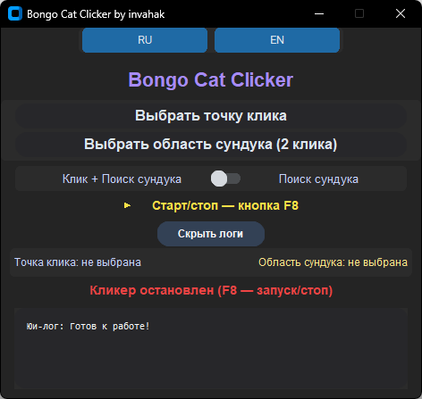
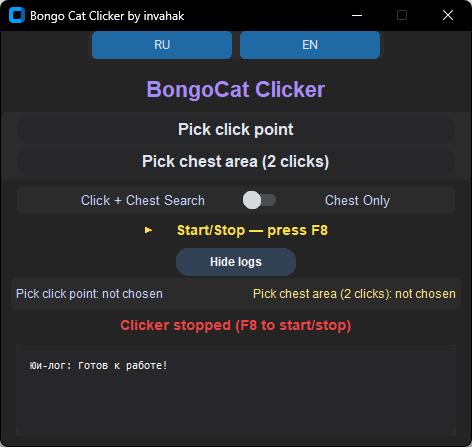

# Bongo Cat Clicker by Invahak 🐾

Автокликер с функцией поиска объектов на экране.  
Auto clicker with object detection support.

---

## 🖼 Интерфейс | Interface

| 🇷🇺 Русская версия | 🇬🇧 English version |
|:-----------------:|:------------------:|
|  |  |

---

## ✨ Особенности | Features

- 🔥 Режим "Клик + Поиск сундука" | "Click + Chest Search" mode
- 🔎 Режим "Только поиск сундука" | "Chest Only" mode
- 🌍 Полная поддержка русского и английского языков | Full Russian and English language support
- 🌗 Тёмная тема интерфейса | Dark theme interface
- 🖱️ Эмуляция реального клика через Windows API | Human-like click emulation (SendInput)

---

🚀 Установка | Installation
Скачайте репозиторий или ZIP-архив
Download this repository or ZIP archive.

Установите зависимости | Install requirements:
```bash
pip install -r requirements.txt
```

Запуск через Python | Run via Python:
```bash
python BongoCatClicker.py
```

📦 Сборка .exe | Build as .exe:
Откройте CMD в папке с проектом. Убедитесь, что chest.png лежит рядом.
Open CMD in the project folder. Make sure chest.png is nearby.

```bash
pyinstaller --noconfirm --onefile --windowed --add-data "chest.png;." BongoCatClicker.py
```

Сборка появится в папке dist/
The built file will appear in the dist/ folder.

